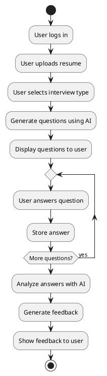
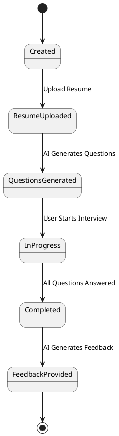
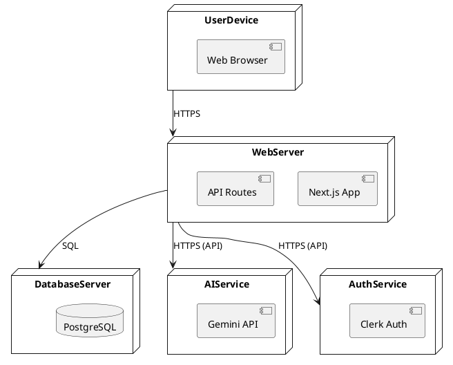
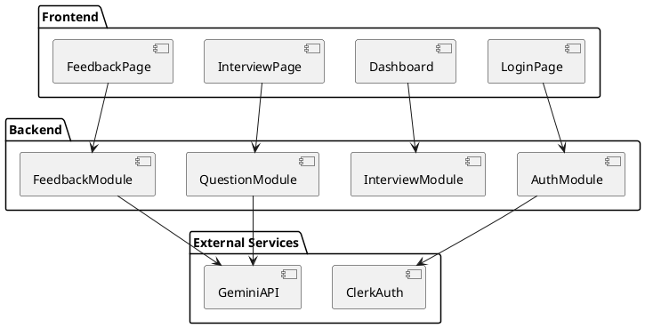
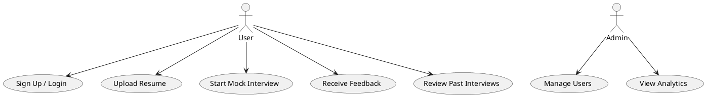
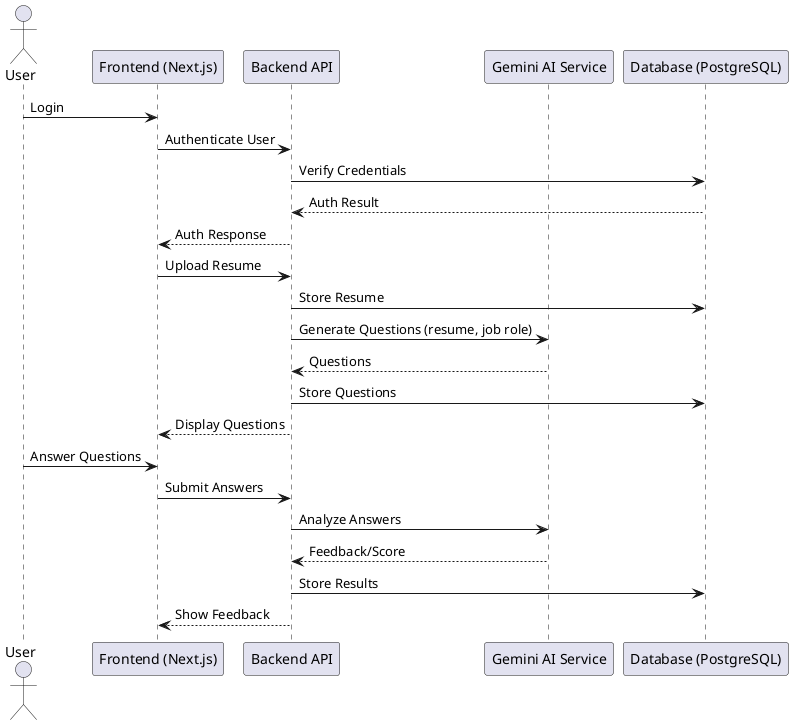
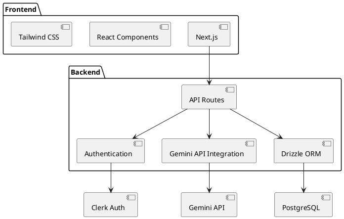
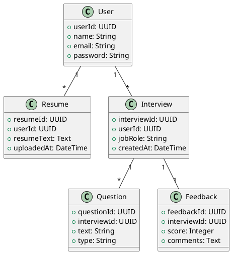

# Major Project Documentation

## ABSTRACT

This project is an advanced and interactive AI-powered mock interview platform designed to help job seekers practice and improve their interview skills. Built with Next.js, Tailwind CSS, Gemini API, PostgreSQL, and Drizzle ORM, it provides users with a seamless and effective interview experience to enhance their chances of landing their dream job.

The platform leverages advanced AI algorithms to generate interview questions that closely mimic real-world scenarios, ensuring that users are exposed to the types of challenges they will face in actual interviews. By incorporating resume-based question generation, the system tailors each session to the user's background, skills, and career aspirations. The integration of instant feedback mechanisms empowers users to identify their strengths and areas for improvement immediately after each session. Furthermore, the use of scalable web technologies guarantees accessibility and performance, making the platform suitable for a wide range of users, from recent graduates to seasoned professionals. The project aims to democratize access to high-quality interview preparation tools, bridging the gap between traditional methods and the evolving demands of the modern job market.

The platform's unique value proposition lies in its ability to provide a holistic and adaptive interview preparation experience. By combining AI-driven question generation, real-time feedback, and comprehensive progress tracking, the platform offers a significant improvement over traditional methods. The user-centric design ensures that the system is intuitive and accessible, while the modular architecture allows for continuous enhancement and expansion of features.

## 1.1 Introduction to the Project

The AI-powered mock interview platform is designed to revolutionize interview preparation by offering:

- **AI-driven mock interviews:** Simulates real interview scenarios using advanced natural language processing and machine learning, providing users with relevant and challenging questions.
- **Personalized experiences:** Utilizes resume parsing and user profiling to tailor questions and feedback to each individual's background, skills, and career goals.
- **Instant feedback:** Delivers actionable insights and performance analysis immediately after each session, helping users identify strengths and areas for improvement.
- **Accessibility and scalability:** Built with modern web technologies to ensure a seamless experience across devices and support for a large user base.
- **Continuous improvement:** Integrates user feedback and analytics to refine AI models and platform features, keeping pace with evolving industry standards.

By combining these elements, the platform empowers users to build confidence, track progress, and enhance their chances of success in competitive job markets. The platform's modular architecture ensures that new features and question domains can be added with ease, keeping the system relevant and up-to-date with industry trends.

## 1.2 Project Category

Web Application / AI-Powered EdTech Platform

The project falls under the category of educational technology (EdTech), utilizing artificial intelligence to enhance the learning and preparation process for job interviews. As a web application, it is accessible from any device with an internet connection, making it convenient for users to practice anytime, anywhere. The use of modern frameworks and cloud-based infrastructure ensures reliability, scalability, and a seamless user experience. By focusing on the intersection of AI and education, the platform contributes to the growing field of intelligent tutoring systems and digital learning environments.

## 1.3 Need for the Project

The need for this project arises from the limitations of traditional interview preparation methods, which often lack personalization, real-time feedback, and adaptability to evolving industry requirements. With the increasing prevalence of AI-driven recruitment and remote interviews, job seekers require new tools to build confidence and master relevant skills. The platform addresses these needs by offering a data-driven, adaptive, and accessible solution that democratizes high-quality interview preparation.

## 1.4 Objectives of the Project

- To provide a personalized, AI-driven mock interview experience for job seekers.
- To deliver instant, actionable feedback and performance analytics.
- To simulate real-world interview scenarios, including technical, behavioral, and HR rounds.
- To support continuous learning and progress tracking through a user dashboard.
- To ensure accessibility, scalability, and security using modern web technologies.

## 1.5 Scope of the Project

The scope includes the development of an end-to-end web application with:

- Resume parsing and user profiling
- AI-powered question generation and evaluation
- Real-time feedback and grading
- Interview session management and analytics dashboard
- Secure authentication and data storage
- Responsive, accessible UI for diverse user needs

## 1.6 Methodology

The platform is developed using an agile methodology, emphasizing iterative development, user feedback, and continuous improvement. Core stages include:

- Requirement analysis and feasibility study
- System design and architecture
- Implementation of frontend, backend, and AI modules
- Testing (unit, integration, user acceptance)
- Deployment and maintenance

## 1.7 Existing System

Existing interview preparation platforms typically offer static question banks, limited personalization, and delayed or generic feedback. Many lack AI-driven features, resume-based customization, or real-time analytics, resulting in a less effective learning experience.

## 1.8 Limitations of Existing System

- Lack of personalized question generation
- Minimal or delayed feedback
- Limited support for diverse interview types
- Inadequate progress tracking and analytics
- Poor accessibility and responsiveness on mobile devices

## 1.9 Proposed System

The proposed system overcomes these limitations by leveraging AI, NLP, and modern web technologies to offer:

- Dynamic, resume-based question generation
- Real-time, actionable feedback
- Support for multiple interview types and difficulty levels
- Comprehensive analytics and progress tracking
- Responsive, accessible design for all devices

## 1.10 Features of the System

- AI-powered, personalized mock interviews
- Resume upload and parsing
- Real-time feedback and grading
- Interview session scheduling and management
- User dashboard with analytics and progress tracking
- Secure authentication and data privacy
- Modular, scalable architecture

## 1.11 Literature Survey

A thorough literature survey helps to understand the strengths and weaknesses of existing platforms, identify emerging trends, and inform the design of the proposed system. By reviewing academic research, industry case studies, and technical documentation, the project can incorporate best practices and avoid common pitfalls. The survey also highlights the potential of AI and data-driven approaches to transform the field of interview preparation, providing a solid foundation for innovation.

## 1.12 Literature Forms

- Research papers on AI in EdTech
- Case studies on interview preparation platforms
- Technical documentation on web and AI frameworks

The literature forms encompass a diverse range of sources, including peer-reviewed journals, industry whitepapers, and official documentation. This comprehensive approach ensures that the project is informed by both theoretical insights and practical experience, enabling the development of a robust and effective solution.

## 1.13 Literature Resources

- Online journals
- Official documentation (Next.js, Gemini API, PostgreSQL)
- Industry blogs and articles

These resources provide valuable information on the latest advancements in AI, web development, and educational technology. By staying up-to-date with current research and industry practices, the project can maintain its relevance and effectiveness in a rapidly evolving landscape.

---

## 1.14 Project Motivation

In today’s competitive job market, candidates face increasing pressure to excel in interviews for their desired roles. Traditional interview preparation methods—such as reading books, practicing with friends, or attending workshops—often lack personalization, immediate feedback, and realistic simulation. Many candidates struggle to identify their weaknesses, adapt to evolving industry expectations, or gain confidence in a safe environment. Furthermore, the rise of remote and AI-driven recruitment processes has changed the landscape, demanding new skills and adaptability from job seekers.

This project was motivated by the need to bridge the gap between conventional preparation and the modern requirements of job interviews. By leveraging artificial intelligence, natural language processing, and scalable web technologies, the platform aims to:

- Provide highly personalized, resume-based mock interviews tailored to the user’s background and aspirations.
- Offer immediate, actionable feedback that helps users understand their strengths and areas for improvement.
- Simulate real interview scenarios, including technical, behavioral, and HR rounds, in a low-pressure environment.
- Make quality interview preparation accessible to a wider audience, regardless of location or resources.

The project also seeks to empower users with tools to track their progress, build confidence, and ultimately improve their chances of landing their dream job. The vision is to democratize interview preparation and foster lifelong learning and adaptability among job seekers.

---

## 2.1 Feasibility Study

### 2.1.1 Data Requirement

A successful AI-powered mock interview platform requires a variety of well-structured data sources to deliver personalized and effective user experiences:

- **User profiles and resumes:** These form the foundation for tailoring interview questions to each user's background, skills, and career goals. The system securely stores user information and parsed resume data to enable dynamic, context-aware question generation.
- **Question banks:** A comprehensive and diverse question bank is essential to cover multiple domains, difficulty levels, and interview types (technical, behavioral, situational, etc.). This ensures the AI can generate relevant and challenging questions for a wide range of users.
- **Interview session data:** Capturing detailed records of each interview session—including user responses, timestamps, and session metadata—enables progress tracking, analytics, and continuous improvement of the AI algorithms. This data also supports personalized feedback and adaptive learning paths.
- **Feedback and grading data:** Storing feedback and grading information allows the platform to calibrate evaluation criteria, maintain consistency, and provide users with actionable insights. This data is also used to refine the AI's assessment capabilities over time.

By systematically collecting and managing these data types, the platform ensures robust functionality, data-driven personalization, and continuous improvement.

### 2.1.2 Functional Requirements

The platform is designed to deliver a comprehensive set of core features that address the needs of job seekers and ensure a seamless interview preparation experience:

- **User authentication:** Secure login and registration processes protect user data and ensure privacy. Support for social logins or multi-factor authentication can further enhance security and convenience.
- **Resume upload and parsing:** Users can upload resumes in various formats (PDF, DOCX, etc.), which are then parsed to extract relevant information. This enables the AI to generate questions tailored to each user's experience and skills.
- **AI question generation:** The system leverages advanced AI models to generate personalized interview questions based on user profiles, resumes, and selected job roles or topics. This ensures each session is relevant and challenging.
- **Interview session management:** Users can schedule, start, pause, and resume mock interviews. The platform manages the flow of questions, records responses, and handles session state transitions.
- **Feedback and grading:** After each session, users receive detailed feedback and performance grading. The system highlights strengths, identifies areas for improvement, and provides actionable recommendations to help users progress.

These functional requirements are implemented with a focus on usability, security, and adaptability, ensuring the platform meets the evolving needs of its users.

### 2.1.3 Performance Requirements

- Fast response for question and feedback generation
- Scalable architecture for concurrent users

The system requires a diverse set of data to function effectively. User profiles and resumes form the basis for personalized question generation, while a comprehensive question bank ensures coverage of various domains and difficulty levels. Data from interview sessions, including user responses and feedback, is essential for tracking progress and refining the AI algorithms. Grading data helps to calibrate the evaluation criteria and maintain consistency across sessions.

Functional requirements define the core capabilities of the platform. Secure user authentication ensures data privacy, while resume upload and parsing enable personalized question generation. The AI module is responsible for generating relevant questions and evaluating user responses. Interview session management includes scheduling, conducting, and storing session data. The feedback and grading system provides users with actionable insights, and the dashboard allows for easy review and progress tracking.

Performance requirements focus on the system's ability to deliver a smooth and responsive user experience. The platform must generate questions and feedback in real time, even under high user load. Scalability is achieved through cloud-based infrastructure and efficient resource management, ensuring consistent performance as the user base grows.

Dependability is critical for maintaining user trust and satisfaction. The use of PostgreSQL ensures robust and reliable data storage, while the AI algorithms are designed to deliver consistent and accurate responses. Regular monitoring and maintenance help to identify and address potential issues before they impact the user experience.

Maintainability is achieved through a modular, component-based architecture that simplifies development, testing, and deployment. Comprehensive documentation supports onboarding and collaboration among developers, facilitating ongoing enhancements and bug fixes.

Security is a top priority, with measures in place to protect user data and prevent unauthorized access. Authentication protocols, encrypted storage, and secure API calls are implemented to safeguard sensitive information. Regular security audits and updates ensure compliance with best practices and regulatory requirements.

The platform's user interface is designed to be visually appealing, responsive, and easy to navigate. Tailwind CSS provides a modern aesthetic, while accessibility features ensure that the platform can be used by individuals with diverse needs and abilities. User feedback is incorporated into the design process to continuously improve the look and feel of the application.

## 2.2 Validation

- User testing
- Automated test cases
- Real interview simulation feedback

Validation ensures that the platform meets its objectives and delivers value to users. User testing provides insights into usability and effectiveness, while automated test cases help to maintain code quality. Feedback from real interview simulations is used to refine the AI algorithms and enhance the overall experience.

## 2.3 Expected Hurdles

- Ensuring AI-generated questions are relevant
- Resume parsing accuracy
- Scaling for high user load

Potential challenges include maintaining the relevance and quality of AI-generated questions, achieving high accuracy in resume parsing, and scaling the system to accommodate a growing user base. Proactive monitoring, continuous improvement, and user feedback are essential for overcoming these hurdles.

## 2.4 SDLC Model to be Used

Agile methodology for iterative development and continuous feedback.

The Agile model enables rapid prototyping, frequent releases, and ongoing collaboration with stakeholders. This approach allows the team to respond quickly to changing requirements and incorporate user feedback throughout the development process. Regular sprint reviews and retrospectives ensure that the project stays on track and delivers incremental value.

## 3.1 Design Approach

The platform adopts a component-based, modular design utilizing Next.js and React. This approach is chosen for the following reasons:

- **Modularity:** Each feature or UI element is encapsulated as an independent component, making the codebase easier to maintain, test, and extend. Developers can work on different parts of the application simultaneously without causing conflicts.
- **Reusability:** Components are designed to be reusable across different parts of the application. For example, input fields, buttons, and feedback cards can be used in multiple workflows, reducing code duplication and ensuring consistency.
- **Scalability:** The modular architecture allows the platform to scale easily as new features are added. New components can be integrated with minimal impact on existing functionality.
- **Separation of Concerns:** By separating UI, business logic, and data handling into distinct components and modules, the platform ensures cleaner code and simplifies debugging.
- **Responsiveness:** Leveraging React and Tailwind CSS, the platform provides a responsive user interface that adapts seamlessly to various device sizes and accessibility needs.
- **Navigation & State Management:** Next.js enables efficient routing and server-side rendering, while React’s context and hooks facilitate robust state management across the application.

This design approach ensures that the platform remains maintainable, adaptable to changing requirements, and capable of supporting a growing user base.

## 3.2 Detail Design

The detailed design of the AI Mock Interview Platform is centered around intuitive user flows and robust API integration:

- **User Flows:**
  - **Interview Creation:** Users can easily create new mock interviews by specifying parameters such as job role, experience level, and preferred topics. The UI guides users through each step, validating inputs and providing contextual help.
  - **Interview Participation:** During the interview, users are presented with AI-generated questions. The interface supports answering questions in various formats (text, multiple-choice, file upload, etc.), and provides real-time feedback or hints where applicable.
  - **Interview Review:** After completing an interview, users can review their performance, receive detailed feedback, and access actionable recommendations for improvement. Historical interview data is available for progress tracking.

- **API Integration:**
  - **AI Integration:** The backend communicates with the Gemini API to generate personalized questions, analyze user responses, and deliver feedback. This integration is abstracted through secure API endpoints, ensuring sensitive data and API keys are protected.
  - **Database Integration:** Drizzle ORM and PostgreSQL manage persistent storage of user profiles, interview sessions, and feedback. All data exchanges between frontend, backend, and AI services are handled via RESTful API endpoints, ensuring reliability and scalability.

- **Security & Validation:** All user inputs are validated on both client and server sides to prevent errors and security vulnerabilities. Authentication and authorization are enforced for protected actions.

This detailed design ensures a seamless, secure, and user-friendly experience, supporting the platform’s educational goals and technical robustness.

## 3.3 Architectural Model

The architectural model of the AI Mock Interview Platform is designed to ensure scalability, maintainability, security, and a seamless user experience. The platform follows a modern client-server architecture, leveraging the strengths of cloud-based infrastructure and modular design principles. Here is a detailed breakdown:

### 3.3.1 Overview

- **Client Side (Frontend):** Built using Next.js and React, the frontend is responsible for rendering the user interface, managing user interactions, and communicating with backend APIs. It is highly responsive, accessible, and uses Tailwind CSS for styling.
- **Server Side (Backend):** The backend consists of RESTful API endpoints (Next.js API routes) that handle business logic, authentication, data processing, and integration with the AI (Gemini API) and database (PostgreSQL via Drizzle ORM).
- **AI Service Integration:** The Gemini API is used to generate interview questions, analyze user responses, and provide feedback. This integration is abstracted via backend API calls, ensuring that sensitive operations and API keys remain secure.
- **Database Layer:** PostgreSQL is used for persistent storage of user data, interview sessions, questions, feedback, and analytics. Drizzle ORM provides a type-safe, maintainable way to interact with the database.
- **Authentication & Authorization:** User authentication is managed using Clerk, ensuring secure access to user-specific data and features.
- **Cloud & DevOps:** The platform is containerized using Docker, enabling easy deployment and scalability. Environment variables are used for configuration and secrets management.

### 3.3.2 Component Interactions

- The user interacts with the frontend (Next.js/React), which sends requests to the backend API routes.
- Backend APIs authenticate the user, process the request, interact with the database, and/or call the Gemini API for AI-powered features.
- Responses are sent back to the frontend, which updates the UI accordingly.

### 3.3.2 Additional UML Diagrams (PlantUML)

### Activity Diagram: Mock Interview Session



### State Diagram: Interview Session Lifecycle



### Deployment Diagram



### Package Diagram



### Use Case Diagram



### Sequence Diagram: AI Mock Interview Flow



### Component Diagram



### Class Diagram (Data Models)



### Security Considerations

- All sensitive data is encrypted in transit (HTTPS) and at rest (PostgreSQL).
- API keys and credentials are stored securely using environment variables.
- Role-based access control is enforced for different user types (admin, user).

---

## 4.1 Introduction to Language, IDE’s, Tools and Technologies

- **Language: JavaScript, TypeScript**  
JavaScript is the foundational language of web development, enabling interactive client-side applications in all modern browsers. TypeScript, a statically-typed superset of JavaScript, adds type safety, interfaces, and advanced tooling, which helps catch errors early in development and improves code maintainability. TypeScript's integration with editors and build tools ensures a robust developer experience, making it ideal for large, scalable projects.

- **Frameworks: Next.js, React**  
React is a declarative, component-based JavaScript library for building user interfaces. It enables reusable UI components, efficient rendering using a virtual DOM, and a strong ecosystem for state management and routing. Next.js is a full-stack React framework that adds server-side rendering (SSR), static site generation (SSG), API routes, and optimized performance out-of-the-box. Next.js simplifies routing, improves SEO, and enables hybrid web applications that combine static and dynamic content seamlessly, making it ideal for modern SaaS and EdTech platforms.

- **Database: PostgreSQL**  
PostgreSQL is a powerful, open-source object-relational database system known for its reliability, advanced features, and standards compliance. It supports complex queries, ACID transactions, and extensibility through custom functions and data types. PostgreSQL is chosen for its robustness, scalability, and strong support for structured data, making it suitable for handling user profiles, interview session data, and analytics in enterprise-grade applications.

- **ORM: Drizzle ORM**  
Drizzle ORM is a modern Object-Relational Mapping library designed for TypeScript and JavaScript. It provides type-safe database queries, schema migrations, and seamless integration with PostgreSQL. Using Drizzle ORM abstracts away raw SQL, reduces boilerplate, and ensures that database access is consistent and maintainable. Its type safety and migration tools help prevent runtime errors and streamline collaboration among developers.

- **AI: Gemini API**  
The Gemini API is an AI service that powers intelligent features such as natural language question generation, resume parsing, and feedback analysis. Integrating Gemini API allows the platform to deliver personalized, context-aware interview questions and actionable feedback, simulating real interview scenarios. The API's scalability and advanced NLP capabilities are crucial for delivering a high-quality, adaptive EdTech experience.

- **Styling: Tailwind CSS**  
Tailwind CSS is a utility-first CSS framework that enables rapid UI development with consistent design. It offers a rich set of prebuilt utility classes, allowing developers to style components directly in markup without writing custom CSS. Tailwind ensures responsive, accessible, and visually appealing interfaces, while its configuration-driven approach supports custom themes and design systems. Its integration with modern build tools optimizes CSS for production, reducing bundle size and improving performance.

- **IDE: Visual Studio Code (VS Code)**  
VS Code is a free, open-source code editor developed by Microsoft, widely adopted for JavaScript/TypeScript and web development. It offers intelligent code completion, debugging, integrated terminal, Git support, and a vast ecosystem of extensions for linting, testing, and productivity. VS Code's seamless integration with TypeScript, React, and containerization tools (like Docker) accelerates development, reduces context switching, and enhances code quality through real-time feedback and refactoring tools.

**Summary:**  
Each technology and tool in this stack is chosen to maximize developer productivity, application reliability, and user experience. The combination of TypeScript, React, and Next.js enables building robust, scalable, and maintainable web applications. PostgreSQL and Drizzle ORM ensure secure and efficient data management. Gemini API brings advanced AI capabilities, while Tailwind CSS and VS Code streamline UI development and coding workflows. This carefully selected stack empowers the platform to deliver a modern, feature-rich, and adaptive interview preparation experience.

## 4.2 Coding Standards of Language

- **ES6+ JavaScript/TypeScript standards:**  
The codebase strictly follows ECMAScript 6 (ES6) and later standards, as well as TypeScript best practices. This includes the use of modern syntax such as arrow functions, async/await for asynchronous programming, destructuring assignments, template literals, and block-scoped variables (`let`, `const`). TypeScript further enforces static typing, interfaces, and generics, which help catch errors at compile time and improve code reliability. Adhering to these standards ensures compatibility with the latest JavaScript engines, enhances security, and supports future scalability.

- **Modular, reusable components:**  
The application is architected using a modular approach, where functionality is broken down into small, self-contained components. In React and Next.js, UI elements and logic are encapsulated into reusable components, promoting separation of concerns and single responsibility. This modularity makes the codebase easier to maintain, test, and extend. Developers can rapidly build new features by composing existing components, reducing duplication and fostering consistency across the application.

- **Consistent naming conventions:**  
A clear and consistent naming convention is applied throughout the project. Variables, functions, classes, and files are named descriptively using camelCase for variables and functions, PascalCase for components and classes, and kebab-case or snake_case for file and directory names as appropriate. This consistency improves code readability, minimizes confusion, and makes onboarding new developers more efficient.

To enforce these standards, the project utilizes automated linting tools such as ESLint and formatters like Prettier. ESLint checks for code quality, style, and potential errors, while Prettier ensures consistent formatting. Pre-commit hooks and continuous integration pipelines may be configured to automatically run these tools, preventing non-compliant code from being merged. Comprehensive documentation and inline comments further support code clarity and maintainability, enabling effective collaboration within the development team.

**Summary:**  
By rigorously adhering to modern coding standards, modular design principles, and consistent naming conventions, the project achieves high code quality, maintainability, and scalability. Automated tooling and documentation reinforce these practices, resulting in a robust, collaborative, and future-proof codebase.

## 4.3 Testing Techniques and Test Plans

- Unit testing for components and functions
- Integration testing for API endpoints
- User acceptance testing

A robust testing strategy is implemented to ensure the reliability and correctness of the platform. Unit tests are written for individual components and utility functions, validating their behavior in isolation. Integration tests are conducted for API endpoints and database interactions, verifying that different parts of the system work together as intended. User acceptance testing (UAT) involves real users interacting with the platform to ensure that it meets their needs and expectations. Automated testing frameworks (such as Jest and React Testing Library) are used to streamline the testing process and enable continuous integration (CI/CD). Test cases are documented and regularly updated to reflect changes in the codebase, and test coverage is monitored to identify areas for improvement.

### Example Test Scripts for Endpoint Testing

The following is a sample test script for endpoint testing using Jest and Supertest in a Next.js/Node.js environment. These scripts ensure that API endpoints respond correctly to various requests and handle edge cases appropriately.

```javascript
// __tests__/api/parse-resume.test.js
const request = require('supertest');
const app = require('../../app'); // Adjust path if using custom server, else use Next.js handler

describe('POST /api/parse-resume', () => {
  it('should parse a valid resume file and return extracted data', async () => {
    const res = await request(app)
      .post('/api/parse-resume')
      .attach('resume', '__tests__/fixtures/sample_resume.pdf');
    expect(res.statusCode).toBe(200);
    expect(res.body).toHaveProperty('extractedData');
  });

  it('should return 400 for missing file', async () => {
    const res = await request(app)
      .post('/api/parse-resume');
    expect(res.statusCode).toBe(400);
    expect(res.body).toHaveProperty('error');
  });
});
```

> Note: Adjust the import and app/server handler as per your project setup. For Next.js API routes, you may use `next-test-api-route-handler` or similar utilities.

These endpoint tests can be extended to cover authentication, authorization, and error handling for all RESTful or serverless API routes in the platform.

### Testing Endpoints from the Console

You can also test API endpoints directly from your console or terminal using tools like `curl` or [HTTPie](https://httpie.io/). This is useful for quickly verifying endpoint behavior without writing scripts. Here are some example commands:

**Using curl:**

```sh
# Test a POST endpoint with a file upload
curl -X POST http://localhost:3000/api/parse-resume -F "resume=@/path/to/sample_resume.pdf"

# Test a GET endpoint
curl http://localhost:3000/api/some-endpoint

# Test a POST endpoint with JSON data
curl -X POST http://localhost:3000/api/interview -H "Content-Type: application/json" -d '{"role": "Frontend Developer", "experience": 3}'

# Test a PUT endpoint
curl -X PUT http://localhost:3000/api/interview/123 -H "Content-Type: application/json" -d '{"status": "completed"}'

# Test a DELETE endpoint
curl -X DELETE http://localhost:3000/api/interview/123

# Test an endpoint with custom headers (e.g., for authentication)
curl -H "Authorization: Bearer <your_token>" http://localhost:3000/api/protected-endpoint
```

**Using HTTPie:**

```sh
# Test a POST endpoint with a file upload
http -f POST http://localhost:3000/api/parse-resume resume@/path/to/sample_resume.pdf

# Test a GET endpoint
http GET http://localhost:3000/api/some-endpoint

# Test a POST endpoint with JSON data
http POST http://localhost:3000/api/interview role="Frontend Developer" experience:=3

# Test a PUT endpoint
http PUT http://localhost:3000/api/interview/123 status="completed"

# Test a DELETE endpoint
http DELETE http://localhost:3000/api/interview/123

# Test an endpoint with custom headers (e.g., for authentication)
http GET http://localhost:3000/api/protected-endpoint "Authorization:Bearer <your_token>"
```

These commands allow you to:

- Upload files
- Send JSON payloads
- Update or delete resources
- Pass authentication tokens or custom headers
- Test all HTTP methods (GET, POST, PUT, DELETE)

This versatility makes console tools ideal for rapid API development, debugging, and manual validation of endpoint security and behavior.

| Command | Description | Example |
| --- | --- | --- |
| `curl -X POST` | Send a POST request with a file upload | `curl -X POST http://localhost:3000/api/parse-resume -F "resume=@/path/to/sample_resume.pdf"` |
| `curl -X POST` | Send a POST request with JSON data | `curl -X POST http://localhost:3000/api/interview -H "Content-Type: application/json" -d '{"role": "Frontend Developer", "experience": 3}'` |
| `curl -X PUT` | Send a PUT request to update a resource | `curl -X PUT http://localhost:3000/api/interview/123 -H "Content-Type: application/json" -d '{"status": "completed"}'` |
| `curl -X DELETE` | Send a DELETE request to delete a resource | `curl -X DELETE http://localhost:3000/api/interview/123` |
| `curl -H` | Pass custom headers (e.g., for authentication) | `curl -H "Authorization: Bearer <your_token>" http://localhost:3000/api/protected-endpoint` |

## 5.1 User Interface Representation

(This section intentionally left blank as per user instruction.)

## 5.2 Snapshots of system with brief detail of each

(This section intentionally left blank as per user instruction.)

## 5.3 Back End Representation

(This section intentionally left blank as per user instruction.)

## 5.4 Sample Coding

(This section intentionally left blank as per user instruction.)

---

## 6. CONCLUSION

The AI-powered mock interview platform provides a scalable, personalized, and effective solution for job seekers to prepare for interviews, leveraging the latest in AI and web technologies.

By integrating artificial intelligence, natural language processing, and modern web frameworks, the platform transcends traditional interview preparation methods. It empowers users with tailored, realistic practice sessions, immediate feedback, and actionable insights, all within an accessible and user-friendly environment. The modular architecture and cloud-based infrastructure ensure that the system can evolve to meet changing industry demands and user expectations. Through continuous validation and user feedback, the platform remains at the forefront of EdTech innovation, democratizing access to high-quality interview preparation and fostering lifelong learning and adaptability among job seekers.

## 7. FUTURE SCOPE

- Support for more languages
- Advanced analytics and reporting
- Integration with job portals
- Real-time video interview simulation

The future scope of the platform includes expanding language support to cater to a global audience, implementing advanced analytics for deeper insights into user performance, and integrating with job portals to streamline the application process. The addition of real-time video interview simulation will further enhance the realism and effectiveness of the preparation experience. Ongoing research and development will focus on leveraging emerging AI technologies, improving resume parsing, and personalizing feedback to address the evolving needs of job seekers and recruiters alike.

## 8. REFERENCES AND BIBLIOGRAPHY

- Next.js Documentation
- Tailwind CSS Docs
- Gemini API Docs
- PostgreSQL Docs
- Industry blogs and research papers

The references and bibliography section provides a comprehensive list of resources used in the development and documentation of the platform. Official documentation for core technologies ensures adherence to best practices, while industry blogs and research papers offer insights into the latest trends and innovations in AI, web development, and EdTech.

---

## 8.x Appendix

### Glossary

- **AI (Artificial Intelligence):** Technology enabling machines to simulate human intelligence and decision-making.
- **NLP (Natural Language Processing):** A field of AI focused on the interaction between computers and human language.
- **REST (Representational State Transfer):** An architectural style for designing networked applications.
- **JWT (JSON Web Token):** A compact, URL-safe means of representing claims to be transferred between two parties.
- **ORM (Object-Relational Mapping):** A programming technique for converting data between incompatible systems using object-oriented programming languages.

The glossary provides definitions for key terms and acronyms used throughout the documentation, ensuring clarity and a shared understanding among readers from diverse backgrounds.

### Acronyms

- **API:** Application Programming Interface
- **UML:** Unified Modeling Language
- **CI/CD:** Continuous Integration / Continuous Deployment
- **IDE:** Integrated Development Environment

### Additional Resources

- Official documentation for Next.js, Tailwind CSS, Gemini API, PostgreSQL, Clerk, and Drizzle ORM
- PlantUML documentation for diagram generation
- Industry research papers and blogs related to AI in education and recruitment
- Open-source repositories and community forums for best practices and troubleshooting

Additional resources are provided to support further exploration and learning. These references enable developers, researchers, and users to deepen their understanding of the technologies and methodologies employed in the platform, as well as to stay informed about ongoing advancements in the field.

---

*This document is based on the current implementation and codebase of the AI Mock Interview platform as of April 2025.*
